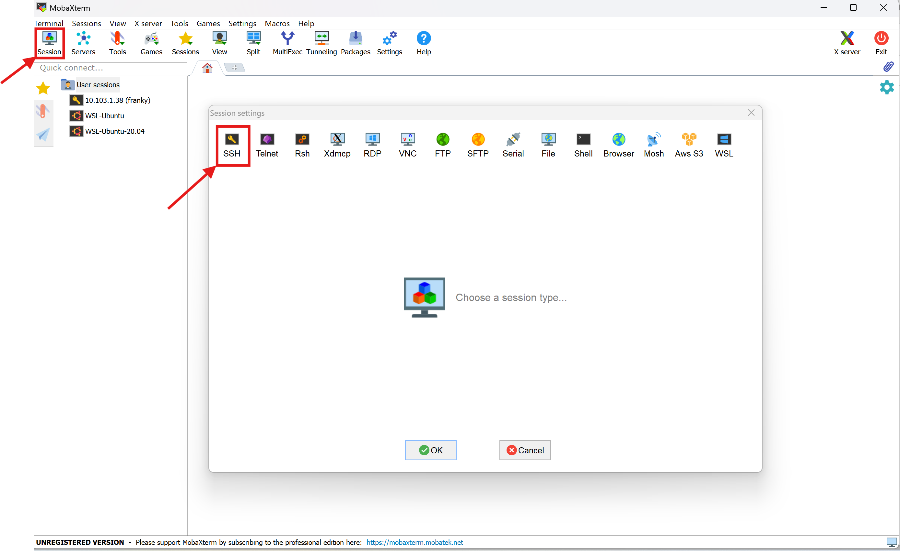
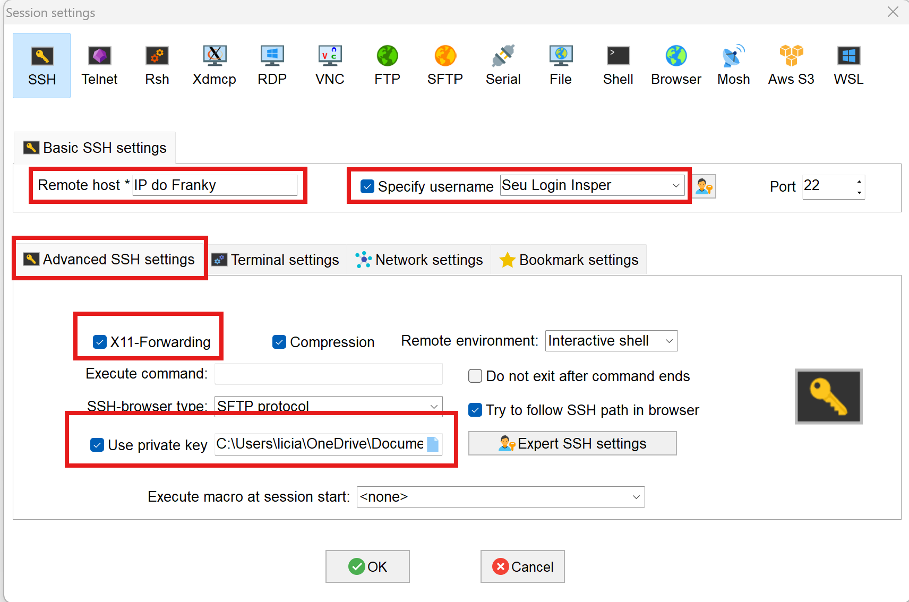
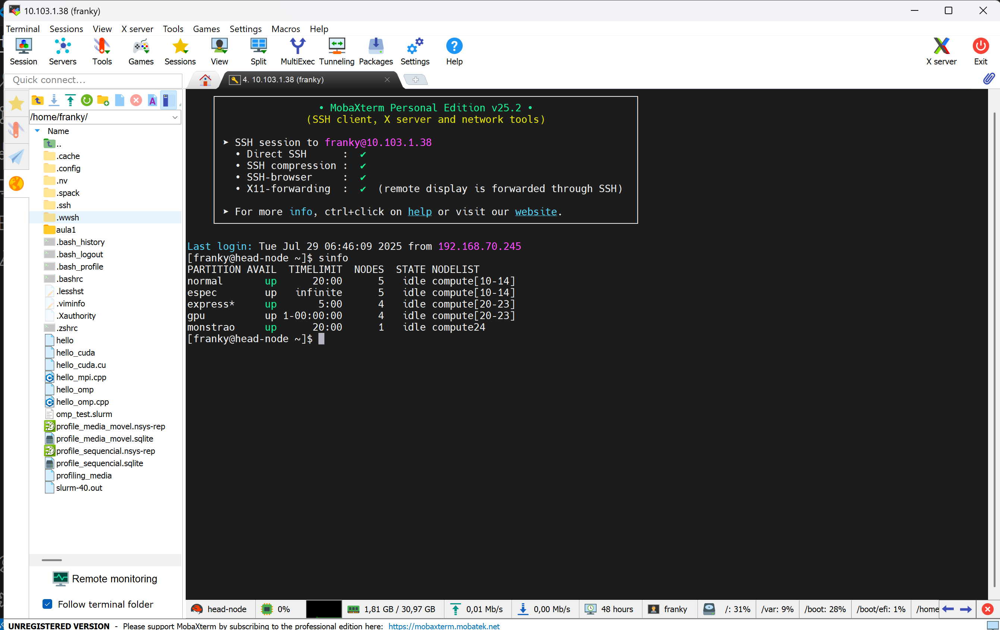
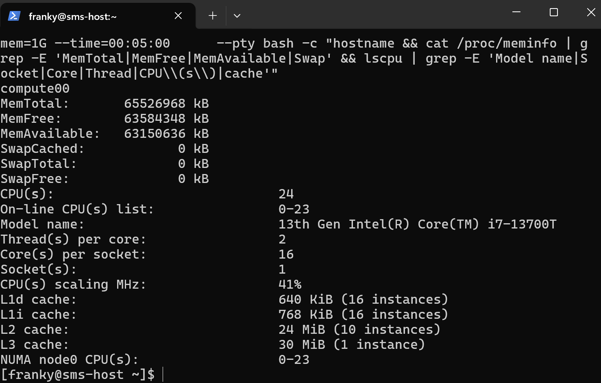
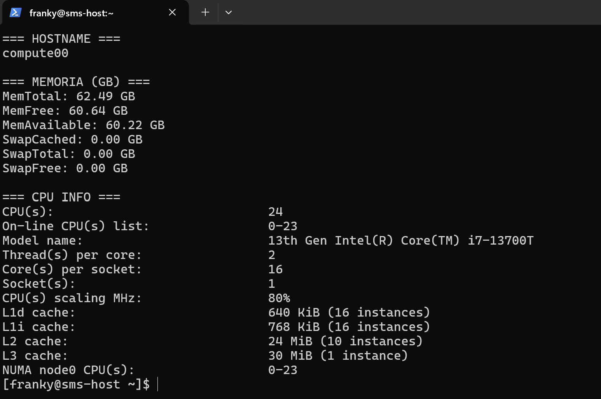

# Aula 02: Acessando o Cluster Franky

Na Atividade 2, você irá executar as implementações que foram testadas na Atividade 1, mas agora no ambiente de um cluster HPC usando SLURM. O objetivo é observar como o ambiente de cluster, com suas diferentes arquiteturas de hardware, pode impactar o desempenho das operações computacionalmente intensivas que você já explorou.

### **Parte 0: Configurando seu acesso ao Cluster Franky**

Para ter acesso ao Cluster Franky você precisa configurar suas credenciais de acesso e realizar acesso remoto via SSH.

As chaves foram enviadas para o seu email Insper, Faça o download da pasta completa, que contém os arquivos `id_rsa` (chave privada) e `id_rsa.pub` (chave pública). Dependendo do sistema operacional que você utiliza, siga as instruções abaixo para configurar corretamente seu acesso ao cluster Franky.

#### **Para Macbook ou Linux:**

Abra o terminal, navegue até a pasta onde a chave privada (`id_rsa`) foi baixada, mova a chave para o diretório `.ssh` em sua home:

```bash
mv id_rsa ~/.ssh/
```

Garanta que apenas você possa ler o arquivo:

```bash
chmod 400 ~/.ssh/id_rsa
```

Conecte-se ao cluster utilizando o comando SSH:

O login é o seu "usuario Insper", o endereço de IP foi fornecido durante a aula.


```bash
ssh -i ~/.ssh/id_rsa login@ip_do_cluster
```
ou

```bash
ssh login@ip_do_cluster
```


#### **Para Windows:**


**Usando MobaXTerm**

Baixe o MobaXterm Home Edition em:
https://mobaxterm.mobatek.net/download-home-edition.html

Execute a aplicação, com o MobaXterm aberto, clique em Session, depois em SSH.


Preencha todos os campos marcados em vermelho


Estabeleça a conexão, se tudo der certo, você verá algo como:



### Configurar o VS Code para Acesso Remoto ao Cluster

**Instale a Extensão Remote - SSH**:

Abra o VS Code, vá para a aba de extensões (ícone de quadrado no lado esquerdo). Pesquise por "Remote - SSH" e instale a extensão oficial da Microsoft.

**Configurar o Acesso Remoto**:

Pressione `Ctrl+Shift+P` (ou `Cmd+Shift+P` no Mac) para abrir o painel de comandos.

Digite `Remote-SSH: Add New SSH Host...` e selecione a opção.

Insira o comando SSH para conexão com o Franky:
```bash
ssh -i Endereço_da_cahve/id_rsa login@ip_do_cluster
```
Escolha o arquivo de configuração padrão (`~/.ssh/config` para Mac/Linux ou `C:\Users\seu_usuario\.ssh\config` para Windows).

Pressione `Ctrl+Shift+P` (ou `Cmd+Shift+P` no Mac) novamente e digite `Remote-SSH: Connect to Host...`. Selecione o host configurado.

O VS Code abrirá uma nova janela conectada ao ambiente remoto do cluster.


**Gerenciar Projetos Remotamente**:

 Após a conexão, você pode abrir pastas e arquivos no cluster diretamente pelo VS Code.

 Você pode utilizar os recursos do VS Code, como o terminal integrado e o debug para trabalhar no cluster Franky.


###  Executando a Atividade no Cluster Franky usando SLURM

Um arquivo .slurm é usado para "lançar jobs" no sistema SLURM, especificando os recursos necessários para a execução, como memória, número de máquinas e núcleos. Nesse arquivo, também definimos como desejamos o output do executável e onde o sistema pode encontrar o arquivo a ser executado. Como a equipe que gerencia o Cluster definiu que os jobs sejam lançados apenas da pasta SCRATCH, podemos omitir o caminho do arquivo nos nossos arquivos .slurm.

!!! warning
      Quando você escreve um script para ser executado pelo SLURM o gerenciador de jobs SLURM interpreta `#SBATCH` como **diretivas que definem como o job deve ser executado.**


### Conhecendo o Sistema

Antes de começar a fazer pedidos de recursos pro SLURM, vamos conhecer os diferentes hardwares que temos disponível no Franky. Vamos utilizar alguns comandos de sistema operacional para ler os recursos de CPU, memória e GPU disponíveis


### Comandos utilizados

* `lscpu`: mostra detalhes da CPU (núcleos, threads, memória cache...)
* `cat /proc/meminfo`: mostra detalhes sobre a memória RAM 
* `nvidia-smi`: mostra detalhes de GPU, se disponível

### Comando SRUN

```bash
srun --partition=normal --ntasks=1 --cpus-per-task=1 --mem=1G --time=00:05:00 \
--pty bash -c "hostname && \
cat /proc/meminfo | grep -E 'MemTotal|MemFree|MemAvailable|Swap' && \
lscpu | grep -E 'Model name|Socket|Core|Thread|CPU\\(s\\)|cache' && \
{ command -v nvidia-smi &> /dev/null && nvidia-smi || echo 'nvidia-smi não disponível ou GPU não detectada'; }" 
```

Você deve ver algo como:




`srun`

> É o comando do SLURM usado para **executar uma tarefa interativamente** em um nó do cluster.

`--partition=normal`

> Indica **em qual fila** (partição) o job será executado.
> No seu caso, `normal` pode ser substituído por qualquer outra fila do sistema

`--ntasks=1`

> Solicita **1 tarefa** (processo).
> Se você estivesse rodando um código paralelo, faz sentido trocar esse valor.

`--cpus-per-task=1`

> Cada tarefa receberá **1 CPU (core)**.
> Quando estiver usando paralelismo com várias threads , faz sentido aumentar esse valor.

---

`--mem=1G`

> Aloca **1 gigabyte de memória RAM** para essa tarefa.
> Se ultrapassar esse limite, o job será encerrado.


`--time=00:05:00`

> Define um **tempo máximo de execução de 5 minutos**.
> Depois disso, o SLURM mata o processo automaticamente.

`--pty bash`

> Solicita um terminal para o SLURM dentro do nó de computação.
> Interessante para fazer testes no código ou realizar debugs

`{ command -v nvidia-smi &> /dev/null && nvidia-smi || echo 'nvidia-smi não disponível ou GPU não detectada'; }`

> Esse trecho verifica se o comando `nvidia-smi` está disponível no sistema (ou seja, se há driver NVIDIA instalado e uma GPU NVIDIA acessível).
>
> * Se **`nvidia-smi` estiver disponível**, ele será executado e mostrará as informações da(s) GPU(s) no nó (como nome, memória, uso, driver etc).
> * Se **não estiver disponível** (por exemplo, em nós sem GPU ou sem driver instalado), exibirá a mensagem:
>   `"nvidia-smi não disponível ou GPU não detectada"`.


!!! tip 
      * Em **nós CPU-only** (como os da partição `normal`), é esperado que `nvidia-smi` **não esteja presente**.
      * Para testar o comando em um nó **com GPU**, use `--partition=gpu` ou `--partition=monstrao`  para alocar nós com placas NVIDIA.


O comando abaixo faz exatamente a mesma coisa, mas eu coloquei ele dentro de um shell script para ter uma formatação melhor no display:

```bash
srun --partition=normal --ntasks=1 --pty bash -c \
"echo '=== HOSTNAME ==='; hostname; echo; \
 echo '=== MEMORIA (GB) ==='; \
 cat /proc/meminfo | grep -E 'MemTotal|MemFree|MemAvailable|Swap' | \
 awk '{printf \"%s %.2f GB\\n\", \$1, \$2 / 1048576}'; \
 echo; \
 echo '=== CPU INFO ==='; \
 lscpu | grep -E 'Model name|Socket|Core|Thread|CPU\\(s\\)|cache'
 echo '=== GPU INFO ==='; \
 if command -v nvidia-smi &> /dev/null; then nvidia-smi; else echo 'nvidia-smi não disponível'; fi"
```



O comando `sinfo` mostra quais são as filas e quais são os status dos nós 

```bash
sinfo
```
O comando abaixo mostra detalhes sobre os recursos de cada fila

```bash
scontrol show partition
```

Recomendo que você mude o nome da fila (partition) no comando abaixo para se ambientar no Cluster Franky e desconrir quais são as diferenças entre as filas

```bash
srun --partition=normal --ntasks=1 --cpus-per-task=1 --mem=1G --time=00:05:00 \
     --pty bash -c "hostname && cat /proc/meminfo | grep -E 'MemTotal|MemFree|MemAvailable|Swap' && lscpu | grep -E 'Model name|Socket|Core|Thread|CPU\\(s\\)|cache'"

```


# Atividade 02

Na aula passada nós vimos que a linguagem importa, além disso, existem recursos da linguagem que tem o poder de acelerar o nosso código, e mais ainda, podemos usar otimizações a nível de compilação para ir além e conseguir uma otimização ainda maior. Agora vamos executar os scripts da aula passada no Cluster Franky para verificar o quanto o hardware impacta nessa abordagem, como será que ficará o desempenho ao executar os códigos em diferentes arquiteturas de computadores?


Vamos utilizar o SLURM para pedir recursos computacionais do nosso Cluster, agora que você ja conhece o hardware que tem em cada fila, faça as suas escolhas de recursos e teste o seu código!

**Script SLURM para o código em Python:**

media_py.slurm

```bash
#!/bin/bash
#As instruções SBATCH não devem ser descomentadas

#SBATCH --job-name=OLHA_EU
# define o nome do job. Esse nome aparece nas listas de jobs e é útil para identificar o job.

#SBATCH --output=media_py%j.out
# Especifica o arquivo onde a saída padrão (stdout) do job será salva.

#SBATCH --ntasks=1
# Define o número de tarefas que o job executará. Neste caso, o job executa uma única tarefa.

#SBATCH --time=00:10:00
# Define o tempo máximo de execução para o job. Neste caso, o job tem um tempo limite de 10 minutos. Se o job exceder esse tempo, ele será automaticamente encerrado.

#SBATCH --partition=normal
# Especifica a partição (ou fila) onde o job será submetido. Aqui.

time python3 media_movel.py
#Executa o programa dentro do nó de computação.
```

**Script SLURM para arquivos C++:**

Como o C++ é uma linguagem que requer compilação, precisamos gerar o executável antes de preparar o arquivo .slurm.

Dentro da pasta SCRATCH, compile seu código .cpp para gerar o binário.

```bash
g++ media_movel.cpp -o sem_otimizacao
g++ -O2 media_movel.cpp -o otimizacao_O2
g++ -O3 media_movel.cpp -o otimizacao_O3
g++ -Ofast media_movel.cpp -o otimizacao_Ofast
```


media_cpp.slurm
```bash
#!/bin/bash
#SBATCH --job=OI_GALERA
# Define o nome do job. Esse nome aparece nas listas de jobs e é útil para identificar o job.

#SBATCH --output=media_cpp%j.out
# Especifica o arquivo onde a saída padrão (stdout) do job será salva.

#SBATCH --ntasks=1
# Define o número de tarefas que o job executará. Neste caso, o job executa uma única tarefa.

#SBATCH --time=00:10:00
# Define o tempo máximo de execução para o job. Neste caso, o job tem um tempo limite de 10 minutos. Se o job exceder esse tempo, ele será automaticamente encerrado.

#SBATCH --partition=normal
# Especifica a partição (ou fila) onde o job será submetido. Aqui, o job será submetido a fila "normal".


echo "========== SEM OTIMIZACAAAOOOO ========"
time ./sem_otimizacao

echo "========= OTIMIZACAO 02 ==============="
time ./otimizacao_O2

echo "======== OTIMIZACAO O3 ==============="
time ./otimizacao_O3

echo "=========== OFAST ESSA ==============="
time ./otimizacao_Ofast

# Executa os binários dentro do nó de computação.

```


### **Parte 2: Execução das Implementações no Cluster**

**Submissão dos Jobs:**

Utilize o comando `sbatch` para submeter cada script SLURM ao cluster.

**Exemplo:**

```bash
sbatch media_py.slurm
sbatch media_cpp.slurm
```

**Monitoramento dos Jobs:**

Use o comando `squeue` para monitorar o status dos jobs.

**Exemplo:**

```bash
squeue 
```

**Análise dos Resultados:**

Após a execução dos jobs, os resultados estarão disponíveis nos arquivos `.out`  especificados em cada script SLURM.

  - Compare os tempos de execução dos programas no cluster.

  - Troque a fila de submissão no arquivo .slurm e compare o desempenho dos programas novamente

  - Analise como as diferentes arquiteturas de hardware dentro do cluster impactam o desempenho do código, compare também com os seus resultados obtidos na atividade 1, executando na sua máquina local.

!!! tip 
      Se quiser explorar mais os comandos do SLURM, [temos uma material aqui que pode te ajudar](../../teoria/comandos.md)


**Entrega Atividade 2 - Relatório de Desempenho:**

Entregue um arquivo PDF contendo obrigatoriamente:

* Identificação: seu nome completo.

* Relatório: apresente os resultados obtidos em cada implementação, acompanhados de gráficos que mostrem o tempo de execução para cada caso testado.

* Discussão: analise o impacto do ambiente HPC no desempenho das implementações. Indique qual fila apresentou o melhor desempenho e explique os motivos para essa diferença.

Submeta seu relatório até as **08h30 de segunda-feira 18/08, . [pelo Classroom](https://classroom.github.com/a/OKSGuF-b).**


