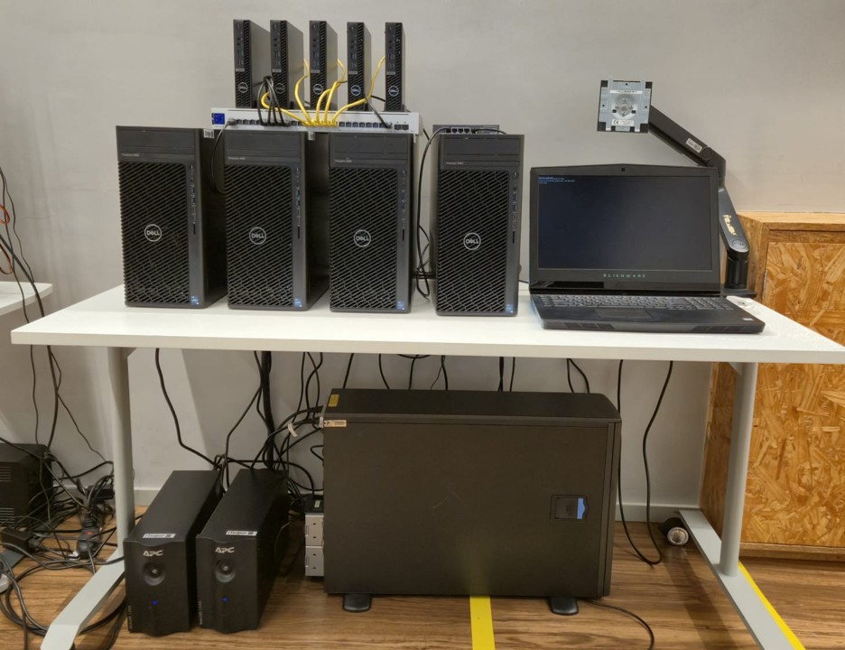

# Contextos e Curiosidades

[O que é um Supercomputador?](https://www.youtube.com/watch?v=kfs7I_sT5YA)

[El Capitan atualmente, o Supercomputador mais rápido do mundo!](https://www.youtube.com/watch?v=MPRjIlgVwlg)

[Santos Dumont o Supercomputador BR que vamos usar no projeto 2!](https://www.youtube.com/watch?v=nN6v0ExmQD4)

[LNCC - Laboratório Nacional de Computação Ciêntifica](https://www.gov.br/lncc/pt-br)

[SINAPAD -  Sistema Nacional de Processamento de Alto Desempenho ](https://www.lncc.br/sinapad/)

### O que é HPC?

**High-Performance Computing (HPC)** refere-se ao uso de supercomputadores e clusters de computadores para resolver problemas computacionalmente complexos. HPC é essencial em campos como ciência, engenharia e finanças, onde grandes volumes de dados precisam ser processados rapidamente.

### TOP 500
Supercomputador **Fugaku**

 [https://spectrum.ieee.org/japans-fugaku-supercomputer-is-first-in-the-world-to-simultaneously-top-all-high-performance-benchmarks](https://spectrum.ieee.org/japans-fugaku-supercomputer-is-first-in-the-world-to-simultaneously-top-all-high-performance-benchmarks)

O [**TOP 500**](https://top500.org/) é uma lista semestral que classifica os 500 supercomputadores mais poderosos do mundo com base no benchmark LINPACK, que mede a capacidade de resolver sistemas de equações lineares. A lista é um indicador importante do progresso em tecnologia de supercomputação. Variações da lista incluem:

- [**Green500**](https://top500.org/lists/green500/): Classifica supercomputadores pela eficiência energética.
- [**Graph500**](https://graph500.org/): Mede o desempenho em tarefas de análise de gráficos.
- [**HPCG**](https://top500.org/lists/hpcg/): Avalia supercomputadores usando um benchmark alternativo ao LINPACK, mais representativo de cargas de trabalho reais em HPC.

### Que tipo de problema é computacionalmente complexo?

Problemas computacionalmente complexos exigem grande capacidade de processamento e memória para serem resolvidos eficientemente. Exemplos incluem:

- Simulações climáticas
- Modelagem molecular
- Processamento de grandes conjuntos de dados (Big Data)
- Análise genômica
- Renderização de gráficos em alta resolução
- Aprendizado de máquina e inteligência artificial

### O que é um supercomputador?

Um **supercomputador** é um sistema computacional de alto desempenho projetado para processar grandes volumes de dados e realizar cálculos complexos muito rapidamente. Ele consiste em milhares de nós de computação interconectados, cada um contendo múltiplos processadores, grande quantidade de memória e armazenamento rápido.

### O que é um Cluster?

Um **cluster** é um conjunto de computadores (nós) conectados que trabalham juntos como se fossem um único sistema. Cada nó em um cluster é um computador independente, mas o sistema inteiro é gerenciado para atuar em conjunto, distribuindo tarefas e compartilhando recursos.

### Qual a diferença de um supercomputador para um cluster?

A principal diferença entre um **supercomputador** e um **cluster** está na integração e desempenho:

- **Supercomputador**: Um sistema integrado de alto desempenho projetado especificamente para computação intensa. Possui uma arquitetura otimizada e interconexões de alta velocidade.
- **Cluster**: São computadores independentes conectados para trabalhar juntos. Pode ser composto por hardware de mercado e geralmente é mais flexível e expansível.

OBS: Muitos supercomputadores modernos são de fato clusters, utilizando milhares de nós interconectados para alcançar um desempenho extremamente alto.

# Cluster Franky

Cluster Franky - Laboratório de Redes e Supercomputação do Insper

Nosso objetivo é preparar você com as habilidades necessárias para utilizar sistemas de HPC em situações reais. Inspirado no supercomputador Santos Dumont, o Cluster Franky oferece um ambiente robusto e seguro para realizar simulações complexas e análises de grandes volumes de dados.

### Como o Sistema Funciona

Para que você compreenda melhor como o Cluster Franky opera, veja a figura abaixo que detalha a arquitetura do sistema:

#### 1. **Conexão e Autenticação**

O processo de interação com o Cluster Franky começa quando você se conecta ao Cluster via SSH através da rede do Insper, em seguida, você será direcionado ao **Login Node**, que serve como o ponto de entrada para o cluster. Para acessar o sistema, é necessário passar por um processo de autenticação usando pares de chaves públicas e privadas, configurados previamente por nossa equipe técnica.

#### 2. **Envio e Gerenciamento de Tarefas (Jobs)**

Uma vez autenticado, você interage com o cluster através do **Slurm**. O Slurm é responsável por gerenciar a execução das tarefas que você submete, distribuindo-as eficientemente pelos recursos de computação disponíveis, que são divididos em:

- **Nó de Computação CPU:** Composto por cinco nós, cada um com 24 threads e 64 GB de RAM.
- **Nó de Computação GPU:** Composto por quatro nós, cada um equipado com uma GPU NVIDIA A1000 com 8GB de VRAM, uma CPU com 64 GB de RAM e 32 threads.
- **Nó de Computação Monstrão:** Composto por um nó equipado com 4 GPU NVIDIA V100 com 32GB de VRAM, uma CPU com 1TB de RAM e 20 threads

Os **daemons de controle** cada nó de computação gerencia a execução das tarefas, garantindo que os recursos sejam alocados de forma otimizada. Isso significa que, independentemente de você estar executando simulações simples ou tarefas intensivas de processamento de dados, o sistema está configurado para maximizar a eficiência e minimizar o tempo de execução.

#### 3. **Armazenamento e Gestão de Dados**

Durante suas atividades, você deve utilizar a pasta **SCRATCH** para armazenar temporariamente os arquivos e dados necessários para suas tarefas. É importante lembrar que essa pasta é destinada ao armazenamento temporário, portanto, certifique-se de salvar seus dados em um local seguro após concluir suas atividades.

O sistema de arquivos atual do Cluster Franky utiliza o **NFS (Network File System)**, que facilita o acesso aos dados entre os nós de computação. No futuro, planejamos migrar para o sistema de arquivos **Lustre**, que oferecerá maior eficiência e melhor desempenho no manuseio de grandes volumes de dados.

### Porque usar o Cluster Franky?

Utilizar o Cluster Franky oferece vários benefícios que vão prepará-lo para desafios reais em HPC:

- **Experiência Prática em HPC:** Ao trabalhar com o Cluster Franky, você terá a oportunidade de realizar tarefas que simulam cenários reais encontrados em supercomputadores como o Santos Dumont. Isso inclui a execução de simulações complexas, a otimização de recursos e o uso inteligente das ferramentas disponíveis.

- **Desenvolvimento de Habilidades Técnicas:** Aprender a utilizar ferramentas avançadas como o Slurm e a interagir com ambientes de computação distribuída irá equipá-lo com habilidades técnicas valiosas, amplamente aplicáveis em diversas áreas de pesquisa e indústria.

- **Preparação para o Mundo Real:** A experiência adquirida com o Cluster Franky será um diferencial no mercado de trabalho, pois você estará familiarizado com práticas e tecnologias utilizadas em sistemas de HPC de ponta.

O Cluster Franky não é apenas uma ferramenta de aprendizado; é uma porta de entrada para o mundo da computação de alto desempenho. Aproveite essa oportunidade para expandir seus conhecimentos, experimentar e se preparar para enfrentar desafios de HPC. Se precisar de ajuda ou tiver dúvidas, procure um de nós!
